# IdeaBlog

本科的毕业设计项目。基于SSM框架实现。做得比较简陋。

## 权限划分
- **游客**访问可浏览博客，提交反馈意见，注册为普通用户；

- **普通用户**除具备游客权限外，还可发表或收藏博客，发表或回复评论，关注用户，上传并分享文件，管理自己的博客和文件，修改个人资料；

- **管理员**除具备普通用户权限外，还可对整个博客系统进行管理和维护，包括系统日志、博客、文件、反馈、用户等。

## 运行效果
### 登录

### 注册，找回账号密码
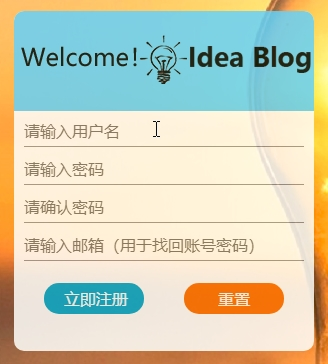  
### 系统主页
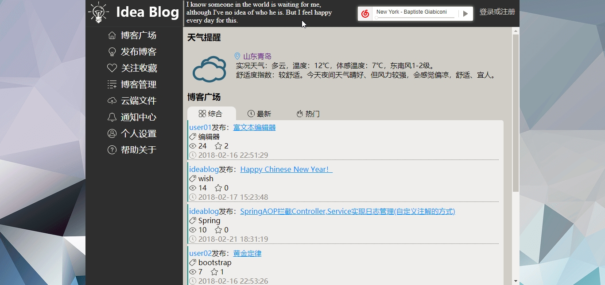
### 发布博客
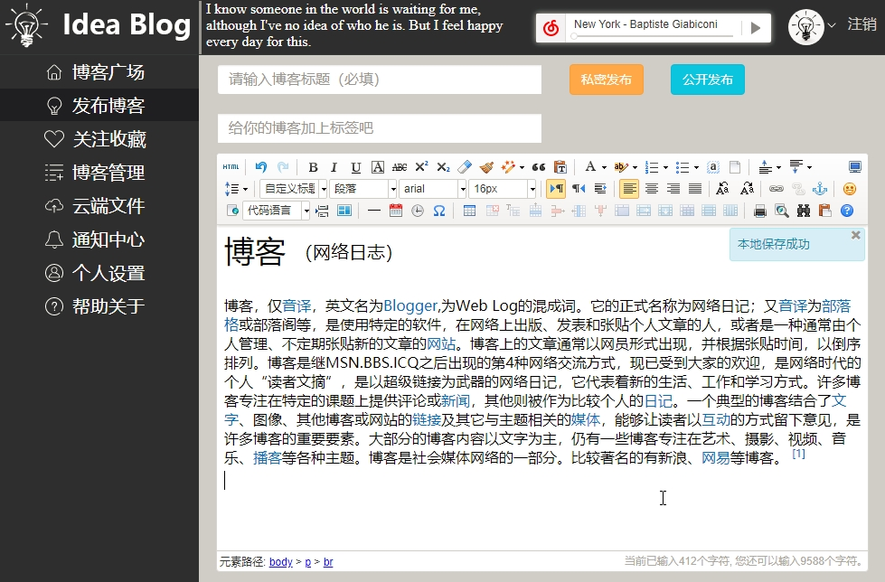
### 查看博客
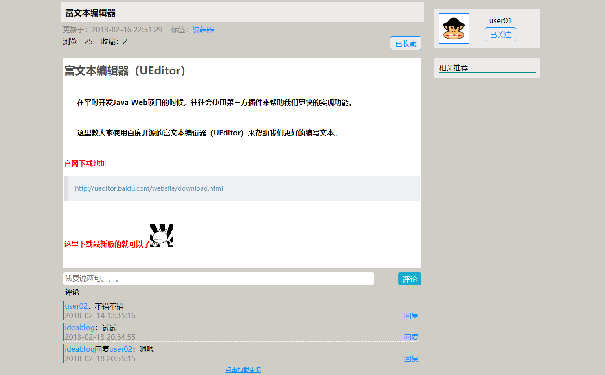
### 关注收藏

### 博客管理
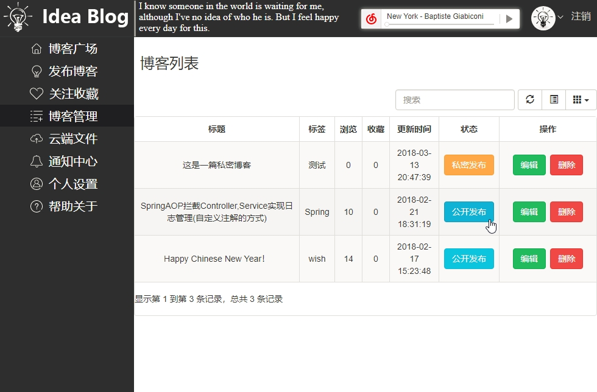
### 云端文件

### 通知中心

### 个人设置
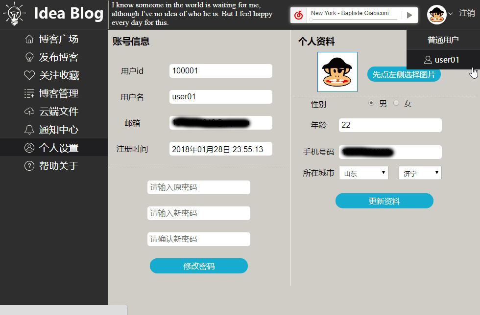
### 帮助关于

### 管理员-主页

### 系统日志管理

### 公开博客管理
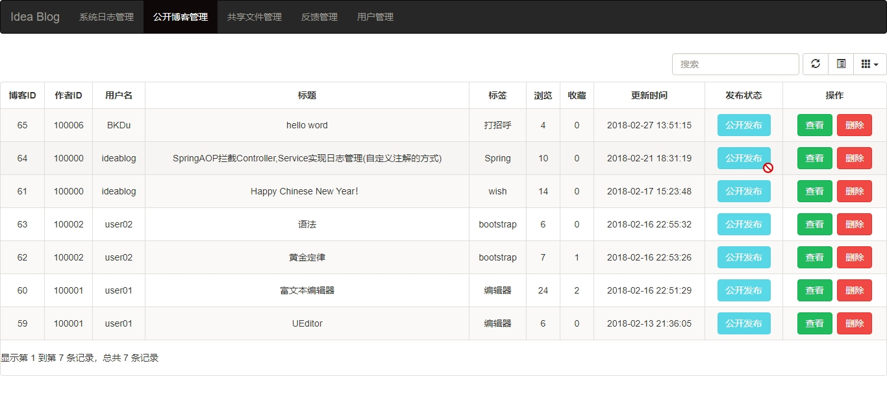
### 共享文件管理
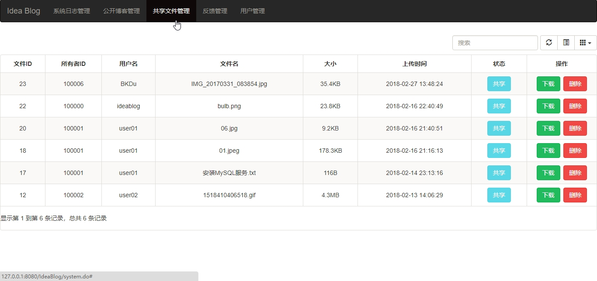
### 反馈管理
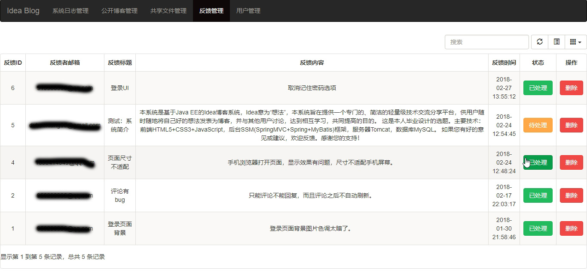
### 用户管理
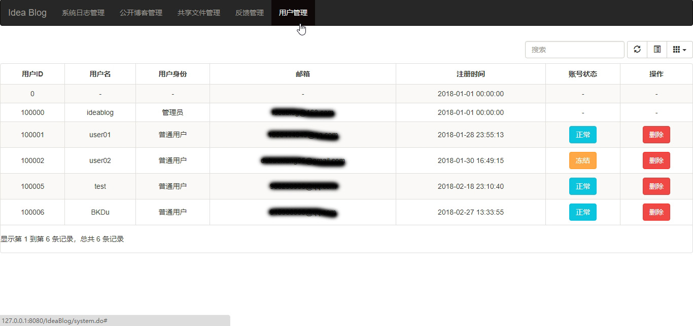
### 邮件-注册和验证码
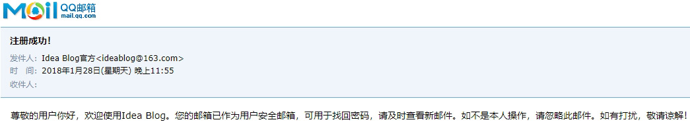
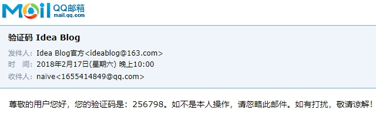
